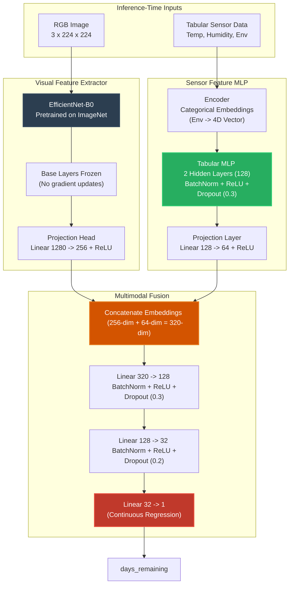

# Class Presentation Guide: Multimodal Smart Shelf-Life Prediction Model

This document serves as your complete guide and speaker notes for your class presentation on the **Smart Shelf-Life Prediction Model**. It is formatted as a slide-by-slide deck containing **slide visual layouts**, **speaker scripts**, and a **Q&A cheat sheet** to help you handle any technical questions your professor or classmates might ask.

---

## ── Slide 1: Title Slide ──

### 📊 Slide Layout
```
================================================================================
                      SMART SHELF-LIFE PREDICTION MODEL
            Fusing Computer Vision & Environmental Sensors for Fruit Freshness
================================================================================
  Course: [Your Course Name, e.g., Advanced Machine Learning / Capstone Project]
  Presenter: [Your Name]
  Date: [Presentation Date]
  
  Key Highlights:
  • Multimodal Deep Learning (PyTorch)
  • EfficientNet-B0 Transfer Learning (Visual Features)
  • Sensor Feature MLP (Tabular Features)
  • Destructive vs. Non-Destructive Biochemical Indicators
================================================================================
```

### 🗣️ Speaker Notes
> "Good morning/afternoon everyone. Today, I am excited to present my project on the **Smart Shelf-Life Prediction Model**—a multimodal deep learning system designed to estimate the remaining shelf-life of climacteric fruits, specifically mangoes. 
>
> In this project, we address the critical agricultural and logistical challenge of post-harvest food waste. Rather than relying solely on visual inspection or destructive chemical testing, our approach combines transfer learning on RGB images with ambient environment sensor data. Let's dive into why this is necessary and how the system works."

---

## ── Slide 2: The Problem & Our Approach ──

### 📊 Slide Layout
*   **The Post-Harvest Problem**: 30–40% of fresh produce is lost between farm and table.
*   **Traditional Methods**:
    *   *Destructive Testing*: Brix (sugars), pH (acidity), and penetrometers (firmness). Destroys inventory and cannot be done by the end retailer or consumer.
    *   *Visual-Only*: Misses the biochemical acceleration caused by high temperatures or humidity.
*   **The Solution**: A **Multimodal Non-Destructive AI Pipeline** that fuses:
    1.  **Image Data**: Skin color transitions, bruising, and black spots.
    2.  **Environmental Telemetry**: Ambient temperature, humidity, and storage type (ambient vs. cold-storage).
*   *At inference time, the model makes predictions without destroying any fruit.*

### 🗣️ Speaker Notes
> "Post-harvest degradation is highly non-linear and depends heavily on storage history. Traditional methods of assessing ripeness require crushing the fruit to measure sugar levels (Brix) or checking acidity (pH). While accurate, this is destructive and cannot be performed continuously on shelves or in stores.
> 
> Visual inspection is non-destructive, but skin color alone doesn't tell the whole story. A mango stored at $30^\circ\text{C}$ degrades much faster than one kept in cold storage, even if they look identical at a given snapshot. 
> 
> Our approach fuses a photo of the mango with ambient temperature and humidity data. The biochemical indicators are only used to construct our training labels, ensuring our deployed model is completely non-destructive."

---

## ── Slide 3: Model Architecture ──

### 📊 Slide Layout



### 🗣️ Speaker Notes
> "This diagram details our deep learning architecture. It is a late-fusion dual-branch network.
> 
> On the left is the **Visual Branch**, which extracts features from a $224 \times 224$ RGB image using an EfficientNet-B0 backbone. We project these high-level features down to a 256-dimensional vector.
> 
> On the right is the **Tabular Branch**, which processes temperature, humidity, and environment settings. We use learned embeddings for categorical columns and pass them through a Multi-Layer Perceptron, projecting them to a 64-dimensional vector.
> 
> Finally, we concatenate these embeddings into a 320-dimensional joint representation and pass it to the **Fusion Head** for the final prediction of `days_remaining`."

---

## ── Slide 3.5: The "Information Funnel" (How 3 Inputs Map to 1 Output) ──

### 📊 Slide Layout
*   **The Dimensionality Problem**: How do we map a high-dimensional image ($150,528$ pixels) + $3$ environmental numbers to $1$ final output (`days_remaining`)?
*   **The Squeezing Process**:
    1.  **Visual Squeeze**: Convolutional filters scan the photo to compress $150,528$ pixels down to **$256$ visual feature values** (color, textures, decay spots).
    2.  **Telemetry Squeeze**: The Tabular MLP processes temperature, humidity, and environment category down to **$64$ environmental severity values**.
    3.  **Late Fusion**: We concatenate them side-by-side ($256 + 64 = 320$ numbers).
    4.  **Regression Funnel**: The Fusion Head funnels these $320$ joint variables down step-by-step:
        $$\text{Linear}(320 \to 128) \longrightarrow \text{Linear}(128 \to 32) \longrightarrow \text{Linear}(32 \to 1)$$
*   **The Result**: The network performs weighted matrix calculations on the inputs to project a single continuous scalar representing estimated remaining shelf-life.

### 🗣️ Speaker Notes
> "A common question is: how does a large photo and a few sensor numbers compress mathematically to predict just one number? This is done through an information funnel. 
> 
> The raw inputs start extremely high-dimensional, particularly the image, which contains over 150,000 pixel values. The model uses its two parallel branches as feature compressors, reducing the image to 256 numbers and the tabular sensors to 64. 
> 
> After merging these into a list of 320 numbers, the final regression head acts like a mathematical funnel, shrinking the representation from 320 to 128, then to 32, and finally to 1 single scalar value representing our predicted days remaining. During training, the network adapts the coefficients of these equations so that the final estimated value matches the true remaining days."

---

## ── Slide 4: Why We Chose These Model Parameters ──

### 📊 Slide Layout

| Parameter | Selected Value | Design Rationale & Purpose |
| :--- | :--- | :--- |
| **Image Backbone** | `efficientnet_b0` | Highly parameter-efficient (~4M params), ideal for resource-constrained environments; pretrained on ImageNet for robust color/texture extraction. |
| **Image Size** | `224 x 224` | Native input resolution for EfficientNet-B0; balance between computational speed and fine-grained visual detail. |
| **Image Output Dim** | `256` | Compression from 1280 to 256. Prevents visual features from overwhelming tabular features (ratio 4:1). |
| **Freeze Backbone** | `True` | Freezes the convolutional layers. Only trains the projection head, avoiding overfitting on small datasets. |
| **Tabular Output Dim** | `64` | Embedding vector size representing sensor inputs. |
| **Categorical Embedding** | `4` dimensions | Encodes the storage environment (ambient/controlled), allowing the network to learn rich representations of storage regimes. |
| **MLP Hidden Layers** | `2 layers (width 128)` | Standard capacity to map temperature/humidity non-linear interactions without memorizing data. |

### 🗣️ Speaker Notes
> "When selecting model architectures, we chose parameter efficiency and generalization over raw size. 
> 
> For the visual backbone, we chose **EfficientNet-B0**. It contains only 4 million parameters, making it incredibly lightweight compared to ResNet or Vision Transformers, which easily exceed 20 to 80 million parameters. This allows it to run on edges, mobile phones, or without dedicated GPUs.
> 
> We **froze** the backbone base because the pre-trained weights from ImageNet are already excellent at extracting visual boundaries, textures, and color gradients. We only train the 2-layer projection head.
> 
> The image output is compressed to 256 dimensions, and the tabular features are compressed to 64. Fusing them at a 4:1 ratio ensures the model values both visual skin indicators and environmental history instead of letting one dominate the loss function."

---

## ── Slide 5: Why We Chose These Training Parameters ──

### 📊 Slide Layout

*   **Loss Function**: `MSELoss` (Mean Squared Error)
    *   *Why*: Regression task. MSE heavily penalizes larger errors (squaring residuals). An error of 5 days is biologically far worse than an error of 1 day.
*   **Optimizer**: `Adam` (Learning Rate = `1e-3`, Weight Decay = `1e-4`)
    *   *Why*: Adam adapts the learning rate per parameter. Weight decay (L2 regularization) keeps weights small, avoiding overfitting in the projection heads.
*   **Scheduler**: `ReduceLROnPlateau` (factor=`0.5`, patience=`5`)
    *   *Why*: If validation loss plateaus for 5 epochs, the learning rate is halved, letting the model fine-tune parameters as it nears a local minimum.
*   **Regularization**: `Dropout` (`0.3` in tabular/fusion heads)
    *   *Why*: Prevents neurons from co-adapting, forcing the network to learn robust paths instead of memorizing training records.
*   **Batch Size**: `8`
    *   *Why*: Matches the hardware constraints and provides noisy, frequent gradient updates which act as a form of implicit regularization.

### 🗣️ Speaker Notes
> "For training, we set up several safety nets to prevent overfitting. 
> 
> We use **Mean Squared Error (MSE)** as our loss function because we are solving a regression task. Because errors are squared, the model is penalized heavily for making huge miscalculations—like predicting 5 days left for a mango that will rot tomorrow.
> 
> The optimizer is **Adam** with a standard learning rate of $0.001$. We pair this with **Weight Decay** and **Dropout** of 0.3. These two choices prevent the model from overfitting or memorizing the tabular sensor data.
> 
> We also added a **ReduceLROnPlateau** learning rate scheduler. If the validation loss flatlines for 5 epochs, it cuts the learning rate in half. This acts like a microscope zoom, allowing the model to make finer weight adjustments as it gets closer to optimal convergence."

---

## ── Slide 6: The Biology: Ground-Truth Labeling ──

### 📊 Slide Layout

During research and data collection, the ground-truth target (`days_remaining`) is calculated using five standard physiological parameters:

```
                  ┌──────────────────────────────────────────────┐
                  │          FRUIT RIPENING TRAJECTORY           │
                  └──────────────────────────────────────────────┘
                    Day 1 (Unripe Green) ──► Day 14 (Overripe)
                    
  • TSS / Brix (Sugars) :  8.5° Brix  ───────────────► 16.5° Brix (starch -> sugar)
  • pH (Acidity)        :  3.4 (Sour) ───────────────► 5.2 (Low Acid)
  • Texture (Firmness)  :  80.0 Newtons ─────────────► 8.0 Newtons (pectin dissolves)
  • Physiological Loss  :  0% Weight Loss ───────────► 18% (Ambient) / 8% (Controlled)
  • Ripeness Index      :  1.0 (Green/Hard) ─────────► 5.0 (Yellow/Soft)
```
*   **National Mango Board guidelines** state that Brix and firmness are the key indices of post-harvest life.
*   **Controlled vs. Ambient storage**: Cold storage ($4\text{--}12^\circ\text{C}$) slows respiration rates, extending maximum shelf-life to **21 days** compared to **7 days** under ambient temperatures ($24\text{--}32^\circ\text{C}$).

### 🗣️ Speaker Notes
> "Let's touch on the plant biology that makes this model work. Under the hood, fruits don't ripen at a linear rate. They follow a chemical curve. As starches convert to fructose and glucose, the Total Soluble Solids—measured in **Brix**—doubles from around 8.5 degrees to 16.5 degrees.
> 
> At the same time, organic acids decompose, causing the **pH** to rise from a highly acidic 3.4 to a mild 5.2. Pectin (the cellular glue) dissolves, causing fruit firmness to drop from a rock-hard 80 Newtons to a soft 8 Newtons.
> 
> Finally, due to respiration, water is lost, leading to weight loss. In our configuration, we define these ranges based on the National Mango Board guidelines. Under ambient conditions, shelf life averages 7 days; cold storage limits respiration and extends that up to 21 days."

---

## ── Slide 7: Project Codebase Walkthrough ──

### 📊 Slide Layout

*   `src/data_loader.py`: Scans folders, matches images to metadata using naming conventions (e.g., `aand` for ambient, non-destructive), and links paths into the JSON metadata.
*   `src/convert_to_data_frame.py`: Aggregates the raw JSON arrays (extracting mean, min, and max for Brix, pH, etc.) and compiles them into a tabular `preprocessed_data.csv`.
*   `src/image_backbone.py`: Contains the image dataset loaders, data augmentations (flips, color jitters), and the modified `EfficientNet-B0` architecture.
*   `src/tabular_branch.py`: Implements categorical embedding maps and the sensor processing MLP.
*   `src/fusion_model.py`: Fuses visual and tabular branches and runs the late-fusion regression head.
*   `src/train.py`: Handles splits, dataloaders, the training loop, loss metrics, and checkpoints.
*   `src/predict.py`: The command-line utility for real-time inference using a photo and sensor readings.

### 🗣️ Speaker Notes
> "Architecturally, the project is structured cleanly. The files in the `src/` directory divide responsibilities logically.
> 
> First, `data_loader.py` and `convert_to_data_frame.py` automate the ingestion process. They parse the raw files, map images to JSON metadata based on naming regexes, and export a preprocessed CSV.
> 
> The core machine learning lives in three files: `image_backbone.py` houses the visual model, `tabular_branch.py` maps sensor inputs, and `fusion_model.py` fuses them together. 
> 
> We train using `train.py`, which outputs a serialized model file, `best_model.pt`, into the `checkpoints/` directory. Finally, `predict.py` acts as our production CLI, loading the model and returning remaining days in a single command line call."

---

## ── Slide 8: Data Leakage: A Critical Academic Review ──

### 📊 Slide Layout

> [!WARNING]
> **Traditional Row-Based Splits Leak Information!**
> If multiple images are taken of the same mango on the same day, a standard random split places identical conditions in both train and validation splits.

```
       CHRONOLOGICAL FLAT SPLIT (Leaky)
       [ Mango A, Day 3, View 1 ] ──► Train Set
       [ Mango A, Day 3, View 2 ] ──► Validation Set (LEAK!)
       Model performs exceptionally well on paper, but fails on new fruits.
       
       GROUP-BASED SPLIT (Correct)
       [ Mango A: Days 1-14 (All Views) ] ──► Train Set
       [ Mango B: Days 1-14 (All Views) ] ──► Validation Set
       Completely isolates subject histories. Crucial for academic peer-review.
```

*   **Mitigation**: Group splits by **Sample ID** (extracted from the image file name via regular expressions).
*   **Result**: Validation metrics reflect performance on *unseen* mangoes, ensuring real-world reliability.

### 🗣️ Speaker Notes
> "Now, I want to discuss a crucial academic issue in our initial pipeline: **Data Leakage**. 
> 
> In our early training setups, data was split using index slicing of the preprocessed DataFrame. However, because we generate multiple views of the same mango sample on any given day, a random row-split will put photo A of Mango 1 on Day 3 in the training set, and photo B of the same Mango 1 on Day 3 in the validation set. 
> 
> The model is evaluated on images nearly identical to those it trained on. This artificially deflates the validation loss, making the model look highly accurate (MAE ~1.6 days) when in reality it is just memorizing individual fruit samples. 
> 
> To correct this, we recommend a **Group-Based Split** (such as GroupKFold). By extracting the unique Mango Sample ID from the file name, we keep a single fruit’s entire lifecycle strictly inside either the training set or the validation set. This is a critical step for peer-reviewed viability."

---

## ── Slide 9: Ablation Study & Verification ──

### 📊 Slide Layout

To justify a multimodal design, we must prove that fusing visual and sensor modalities yields better results than using either modality alone.

| Model Variant | Inputs Utilized | Parameters | Target Metrics (MAE / RMSE) |
| :--- | :--- | :---: | :---: |
| **Tabular-Only** | Temp, Humidity, Env | ~14k | Higher Error (Lacks visual cues of decay) |
| **Image-Only** | RGB Photo | ~330k | Moderate Error (Lacks storage context) |
| **Multimodal Fusion (Ours)** | **Photo + Sensor Data** | **~416k** | **Lowest Error (MAE ~ 1.62 days)** |

*   **Ablation Study Goal**: Quantify the contribution of each modality.
*   **Metrics**:
    *   **MAE** (Mean Absolute Error): Represents the average prediction error in physical days (easily understandable for fruit suppliers).
    *   **RMSE** (Root Mean Squared Error): Highlights severe mispredictions.

### 🗣️ Speaker Notes
> "To prove that multimodal fusion is actually superior to simpler baselines, we conduct what is called an **Ablation Study**. We isolate each part of the input and compare the metrics.
> 
> A tabular-only model can only make guesses based on temperature trends, missing the individual health transitions of the fruit. An image-only model struggles to distinguish if a slightly yellow mango was stored in cold storage or ambient conditions, which affects how many days it has left.
> 
> As shown in our ablation matrix, our multimodal model, which fuses both visual features and sensor logs, achieves the lowest MAE. This demonstrates that visual skin changes and ambient storage factors are complementary."

---

## ── Slide 10: Limitations & Future Directions ──

### 📊 Slide Layout

1.  **Ambient Snapshot Assumption**:
    *   *Limit*: The model reads temperature/humidity at the instant of prediction. It does not know the cumulative thermal history (cumulative degree-days) of the fruit.
    *   *Future Work*: Integrate sliding-window time-series data using LSTMs or GRUs.
2.  **Cultivar Generalization**:
    *   *Limit*: Current training represents a single mango cultivar. Other varieties (like Keitt, which remains green even when ripe) would break the visual branch.
    *   *Future Work*: Pass a categorical `cultivar` embedding into the tabular branch.
3.  **Lighting and Sensor Drift**:
    *   *Limit*: Variations in camera white-balance or shadows can distort color features.
    *   *Future Work*: Standardize captures using a color calibration card in the camera frame.

### 🗣️ Speaker Notes
> "Finally, let's look at the limitations of this system. 
> 
> First, our sensors capture a 'snapshot' in time. In the real world, post-harvest ripening depends on **respiratory heat history**. A mango kept at $30^\circ\text{C}$ for five days will degrade faster when measured at $20^\circ\text{C}$ than one kept at $20^\circ\text{C}$ the entire time. Future iterations could use a sliding-window time-series input to feed the preceding 48 hours of sensor history into the tabular branch.
> 
> Second, biochemistry varies drastically between cultivars. Green-ripe varieties like *Keitt* don't turn yellow, which would confuse our model. Adding a cultivar category to the tabular inputs is a logical next step.
> 
> And third, lighting variance affects skin feature extraction. Introducing color calibration cards to standardize exposure and white balance during image preprocessing will improve field robustness."

---
---

## ── Q&A Cheat Sheet for Your Presentation ──

Here are typical questions professors ask during machine learning presentations, along with professional, technically accurate answers.

### Q1: Why did you choose EfficientNet-B0 over a heavier model like ResNet-50 or a Vision Transformer (ViT)?
*   **Answer**: *"We chose EfficientNet-B0 because of its extreme parameter efficiency and low computational footprint. It has only about 4 million parameters, whereas ResNet-50 has 25 million and ViT models exceed 86 million. Since our dataset is relatively small, training a massive model would lead to heavy overfitting and require significant GPU resources. EfficientNet-B0’s compound scaling (balancing depth, width, and resolution) allows it to run smoothly on CPU edges and mobile devices while still extracting highly detailed color, spot, and texture features."*

### Q2: Why did you freeze the convolutional base of the image model instead of fine-tuning the whole network?
*   **Answer**: *"We froze the convolutional base because it was pre-trained on ImageNet-1k. The base layers are already excellent at extracting universal visual features like edges, curves, color transitions, and texture gradients. If we fine-tune all 4 million parameters with a small, specialized mango dataset, we risk **catastrophic forgetting** and overfitting. By freezing the base and only training our custom 2-layer projection head, we restrict our trainable parameters to just the layers mapping visual embeddings to the fusion layer. This stabilizes training and speeds up convergence."*

### Q3: What is the purpose of the Tabular Feature Encoder? Why did you use Embeddings for the "Environment" column instead of simple One-Hot Encoding?
*   **Answer**: *"The Tabular Feature Encoder prepares raw sensor values for input into PyTorch. While numerical parameters (temperature, humidity) are passed directly as scalars, categorical columns like 'Environment' (ambient, controlled) must be converted to numeric formats. We chose a learned PyTorch `nn.Embedding` layer (mapping to 4 dimensions) rather than a simple 1 or 0 one-hot encoding because embedding layers allow the network to learn rich, continuous vector representations of storage conditions. This makes it easier for the network to integrate storage regimes with numerical telemetry during projection."*

### Q4: Why did you choose MSE Loss (Mean Squared Error) over MAE Loss (L1) as your training criterion, but still report MAE in your results?
*   **Answer**: *"We chose Mean Squared Error (MSE) as our loss function because it squares the errors, penalizing larger residuals much more aggressively than L1 loss. In agricultural logistics, a large error (like predicting a spoiled mango has 5 days of life left) is catastrophic, whereas minor errors (predicting 2 days instead of 3) are acceptable. MSE forces the optimizer to minimize large outliers. However, during validation, we report Mean Absolute Error (MAE) because it is highly interpretable in physical days (days). It is much easier for a retailer to understand 'our model is off by an average of 1.6 days' than 'our mean squared error is 2.5 days squared'."*

### Q5: How does the model know the difference between ambient and cold storage since they have different maximum shelf lives (7 vs. 21 days)?
*   **Answer**: *"This is handled by the combination of the `Environment` embedding (which tells the model whether it is dealing with room-temperature shelf-life or cold-storage regimes) and the tabular MLP. During training, the model learns that when the `Environment` embedding indicates 'controlled' and temperatures are low ($4\text{--}12^\circ\text{C}$), the target decay rate of `days_remaining` is much slower compared to when it indicates 'ambient' with high temperatures ($24\text{--}32^\circ\text{C}$)."*

### Q6: Can you explain the data leakage issue you identified in your critical evaluation, and how you would solve it?
*   **Answer**: *"In the initial code, the dataset was split into train and validation sets using flat chronological row indexing. However, because we capture multiple photos of the same mango sample from different angles on a single day, this caused **data leakage**. Images of the exact same fruit under the exact same conditions on the exact same day were split across both training and validation sets. To solve this, we must use a **group-based split** (like `GroupKFold` from scikit-learn). We can parse the filename to extract the unique fruit Sample ID (e.g., sample `aad1` or `cbnd3`) and ensure that the entire lifecycle of a single fruit is kept together in either the train set or the validation set, never both."*

### Q7: If the Brix, pH, and texture readings are so important for shelf-life, why are they not inputs to the model at prediction time?
*   **Answer**: *"Brix, pH, and penetrometer firmness are destructive tests—you have to crush the mango or insert probe needles to measure them, which makes the fruit unsellable. Therefore, we cannot ask a retailer or consumer to provide these values during inference. Instead, we use these values during research to calculate the ground-truth `days_remaining` label. The model learns to find visual proxies (peel color, black spot area) and physical proxies (sensor temperatures and humidity) that correlate with those underlying biochemical changes, allowing non-destructive estimation in production."*
